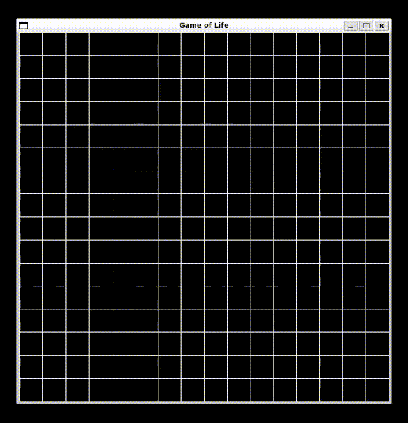

# Game of Life: Python Recreation
This Python program leverages the `pygame` and `numpy` libraries to build an interactive array which then follows a set of rules established in [Conway's Game of Life](https://en.wikipedia.org/wiki/Conway%27s_Game_of_Life#Rules) once triggered (with a space bar) to "self-replicate."

Currently, the program:
1. Has an inefficient/confusing array handling (returning them from functions and such).
2. Does not have a way to zoom in, zoom out, observe number of generations, or speed up/slow down the simulation.
3. Has very messy comments.

With due time, these will be rectified! I hope you enjoy seeing my process working on this.

# Use
1. Clone this repository.
2. Install the dependencies listed in `requirements.txt`
3. `python main.py` or `python3 main.py`

# Future Ideas
1. Build it on my website using `pygbag`.
2. Allow for "dragging" pointer across cells
3. Add a config file
